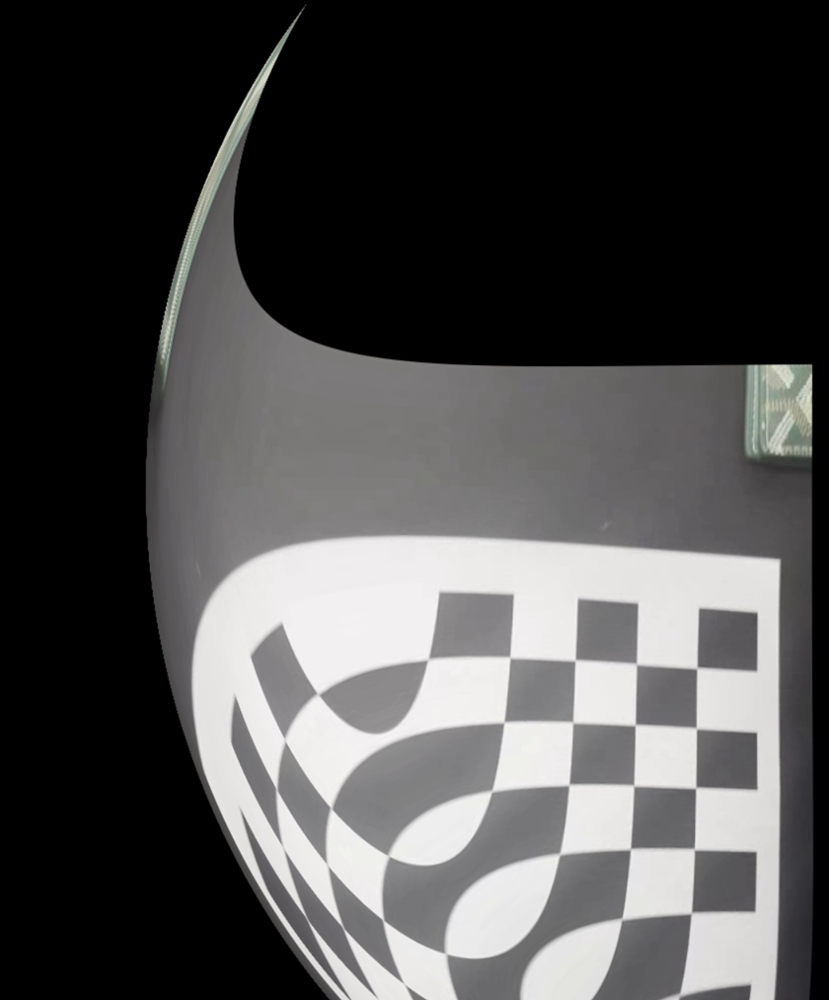

# 🎯 렌즈 왜곡 보정 프로젝트

## 📌 개요
이 프로젝트는 **카메라 캘리브레이션**을 통해 얻은 데이터를 기반으로 **렌즈 왜곡 보정**을 수행하는 프로젝트입니다.  
체스보드 패턴을 이용해 카메라의 내부 파라미터를 추정하고, 이를 이용하여 이미지나 영상에서 발생한 렌즈 왜곡을 보정합니다.

---

## 🔧 사용 기술
- Python
- OpenCV (cv2)
- NumPy

---

## 📷 카메라 캘리브레이션 결과

| 파라미터 | 값 |
|----------|----|
| 초점 거리 fx | 823.37 |
| 초점 거리 fy | 835.81 |
| 주점 cx | 1005.50 |
| 주점 cy | 545.83 |
| 왜곡 계수 (Distortion Coefficients) | `[0.07477567, 0.33346671, -0.00245167, 0.00885194, -1.09295097]` |
| 재투영 오차 (RMSE) | **0.0934 px**

> ※ 아래는 실제 출력된 Camera Matrix입니다:

